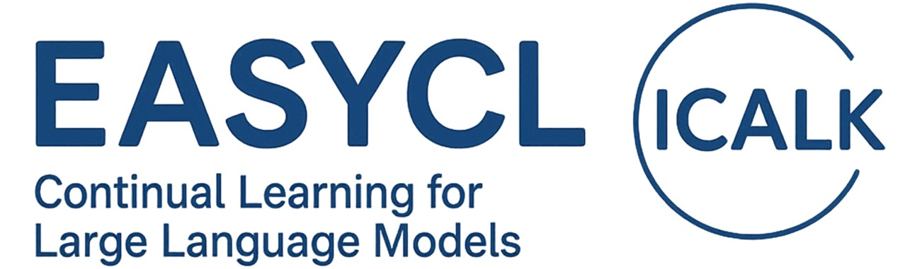

<!-- Logo -->
<p align="center">
  
</p>

[ [English](README.md) | [中文](README_zh.md) ]
[](LICENSE)

##  Status Overview

**Note:** This is currently a development version, so you may encounter some bugs. If you find a bug, please raise an issue or contact me via email: caiyuxuanuestc@hotmail.com or WeChat: damowangdongdong. Thank you very much!

<details>
<summary>🚧 <strong>Known Issues / Upcoming Features</strong></summary>

*   [TODO] Compare results of MoE-LoRA related methods with original implementations.
*   [Feature] Planning to add support for [New Method/Feature].
*   Optimizing memory usage during [Specific Process].

</details>

<details>
<summary>✅ <strong>Resolved Issues / Completed Features</strong></summary>

*   [Resolved] Evaluation does not correctly depend on `dataset_info.json` (2025-04-19).
*   [Resolved] Evaluation uses overly strict generation parameters (e.g., MMLU parameters) (2025-04-19).
*   [Resolved] Pseudo-replay method reads tokenized data instead of raw data (2025-04-20).
*   [Resolved] Gradient Episodic Memory (GEM) causes out-of-memory errors (2025-04-20).
*   [Resolved] Improved O-LoRA logic and fixed dimension mismatch issues (2025-04-20).
*   [Resolved] Fixed issues related to pseudo-sample generation methods and checked parameter imports for all existing methods (2025-04-20).

</details>

## Table of Contents

- [Introduction](#introduction)
- [Implemented Methods](#implemented-methods)
- [Installation](#installation)
- [Dataset Format Requirements](#dataset-format-requirements)
  - [Data Format](#data-format)
  - [Alpaca Format](#alpaca-format)
  - [Sharegpt Format](#sharegpt-format)
  - [Dataset Requirements for Evaluation](#dataset-requirements-for-evaluation)
  - [Continuous Learning Evaluation](#continuous-learning-evaluation)
- [Benchmark Adaptation](#benchmark-adaptation)
  - [Creating a Custom Benchmark](#creating-a-custom-benchmark)
- [Workflow](#workflow)
  - [Train Only](#train-only)
  - [Evaluate Only](#evaluate-only)
  - [Train Then Evaluate](#train-then-evaluate)
  - [Full Workflow (Train, Evaluate, Calculate Metrics)](#full-workflow-train-evaluate-calculate-metrics)
- [License](#license)

## Introduction

EasyCL is an extension of the LLaMA Factory framework, focusing on continual learning methods for large language models. It provides a comprehensive suite of tools and methods to address the problem of catastrophic forgetting in sequential learning tasks.

The framework integrates a variety of state-of-the-art continual learning techniques designed specifically for language models, allowing researchers and practitioners to easily implement, compare, and develop new methods.

For detailed implementation of the continual learning workflow, see [src/easycl/cl_workflow/README.md](src/easycl/cl_workflow/README.md).

## Implemented Methods

1. **Elastic Weight Consolidation (EWC)** - [View Implementation](src/easycl/cl/ewc/README.md) - [Overcoming catastrophic forgetting in neural networks](https://www.pnas.org/doi/pdf/10.1073/pnas.1611835114)

2. **Learning Without Forgetting (LWF)** - [View Implementation](src/easycl/cl/lwf/README.md) - [Learning without forgetting](https://ieeexplore.ieee.org/ielaam/34/8520726/8107520-aam.pdf)

3. **Experience Replay** - [View Implementation](src/easycl/cl/replay/README.md) - [Experience replay for continual learning](https://proceedings.neurips.cc/paper_files/paper/2019/file/fa7cdfad1a5aaf8370ebeda47a1ff1c3-Paper.pdf)

4. **LAMOL (Language Modeling for Lifelong Language Learning)** - [View Implementation](src/easycl/cl/lamol/README.md) - [LAMOL: LAnguage MOdeling for Lifelong Language Learning](https://arxiv.org/pdf/1909.03329)

5. **O-LoRA (Orthogonal subspace learning)** - [View Implementation](src/easycl/cl/olora/README.md) - [Orthogonal subspace learning for language model continual learning](https://arxiv.org/pdf/2310.14152)

6. **Gradient Episodic Memory (GEM)** - [View Implementation](src/easycl/cl/gem/README.md) - [Gradient Episodic Memory for Continual Learning](https://proceedings.neurips.cc/paper/2017/file/f87522788a2be2d171666752f97ddebb-Paper.pdf)

7. **I-LoRA (Interpolation-based LoRA)** - [View Implementation](src/easycl/cl/ilora/README.md) - [Analyzing and Reducing Catastrophic Forgetting in Parameter Efficient Tuning](https://arxiv.org/pdf/2402.18865)

8. **CLMoE (Dual Momentum Mixture-of-Experts LoRA)** - [View Implementation](src/easycl/cl/clmoe/README.md) - [CL-MoE: Enhancing Multimodal Large Language Model with Dual Momentum Mixture-of-Experts for Continual Visual Question Answering](https://arxiv.org/pdf/2503.00413)

9. **MOE-LoRA (Mixture of Experts with LoRA)** - [View Implementation](src/easycl/cl/moe/README.md) - [CoIN: A Benchmark of Continual Instruction Tuning for Multimodal Large Language Models](https://proceedings.neurips.cc/paper_files/paper/2024/file/6a45500d9eda640deed90d8a62742be5-Paper-Datasets_and_Benchmarks_Track.pdf)

10. **ABSCL (ABSA LLM-CL)** - [View Implementation](src/easycl/cl/abscl/README.md) - [Boosting Large Language Models with Continual Learning for Aspect-based Sentiment Analysis](https://arxiv.org/pdf/2405.05496)

11. **Dynamic ConPet** - [View Implementation](src/easycl/cl/dynamic_conpet/README.md) - [ConPET: Continual Parameter-Efficient Tuning for Large Language Models](https://arxiv.org/pdf/2309.14763)

12. **Self-Synthesized Rehearsal (SSR)** - [View Implementation](src/easycl/cl/ssr/README.md) - [Mitigating catastrophic forgetting in large language models with self-synthesized rehearsal](https://arxiv.org/pdf/2403.01244)

13. **Pseudo Replay** - [View Implementation](src/easycl/cl/pseudo_replay/README.md) - [Experience replay for continual learning](https://proceedings.neurips.cc/paper_files/paper/2019/file/fa7cdfad1a5aaf8370ebeda47a1ff1c3-Paper.pdf)

For more details about the continual learning methods, see [src/easycl/cl/README.md](src/easycl/cl/README.md).

## Installation

```bash
git clone https://github.com/ECNU-ICALK/EasyCL.git
cd EasyCL
pip install -e . --no-deps
```
Note that if you already have LLaMA-Factory or an older version of EasyCL installed in your environment, you may need to uninstall the existing one and perform the installation again.

## Dataset Format Requirements

To use EasyCL, your datasets should conform to the LLaMA-Factory dataset format requirements:

### Data Format

The [dataset_info.json](dataset_info.json) file contains all available datasets. If you want to use a custom dataset, you **must** add a *dataset description* in the `dataset_info.json` file and use the dataset by modifying the `dataset: dataset_name` configuration.

Currently, we support datasets in both **alpaca** and **sharegpt** formats.

### Alpaca Format

#### Instruction Supervised Fine-tuning Dataset

In instruction supervised fine-tuning, content from the `instruction` column will be concatenated with content from the `input` column as the human instruction, which means the human instruction will be `instruction\ninput`. And content from the `output` column will be the model's response.

If specified, content from the `system` column will be used as the system prompt.

The `history` column is a list of string pairs, representing instructions and responses in each round of historical conversations. Note that in instruction supervised fine-tuning, responses in historical conversations will **also be used for model learning**.

```json
[
  {
    "instruction": "Human instruction (required)",
    "input": "Human input (optional)",
    "output": "Model response (required)",
    "system": "System prompt (optional)",
    "history": [
      ["First-round instruction (optional)", "First-round response (optional)"],
      ["Second-round instruction (optional)", "Second-round response (optional)"]
    ]
  }
]
```

For data in the above format, the *dataset description* in `dataset_info.json` should be:

```json
"dataset_name": {
  "file_name": "data.json",
  "columns": {
    "prompt": "instruction",
    "query": "input",
    "response": "output",
    "system": "system",
    "history": "history"
  }
}
```

### Sharegpt Format

#### Instruction Supervised Fine-tuning Dataset

Compared to the alpaca format, the sharegpt format supports **more role types**, such as human, gpt, observation, function, etc. They form a list of objects presented in the `conversations` column.

Note that human and observation must appear in odd positions, while gpt and function must appear in even positions.

```json
[
  {
    "conversations": [
      {
        "from": "human",
        "value": "Human instruction"
      },
      {
        "from": "function_call",
        "value": "Tool parameters"
      },
      {
        "from": "observation",
        "value": "Tool results"
      },
      {
        "from": "gpt",
        "value": "Model response"
      }
    ],
    "system": "System prompt (optional)",
    "tools": "Tool descriptions (optional)"
  }
]
```

For data in the above format, the *dataset description* in `dataset_info.json` should be:

```json
"dataset_name": {
  "file_name": "data.json",
  "formatting": "sharegpt",
  "columns": {
    "messages": "conversations",
    "system": "system",
    "tools": "tools"
  }
}
```

#### Dataset Requirements for Evaluation 

EasyCL's evaluation process relies on the `dataset_info.json` file to locate and load required datasets. When running evaluation commands with `--cl_tasks <task_name>` (e.g., `--cl_tasks my_eval_task`), the evaluator will:

1. **Find Test Set**: The evaluator looks for entries matching `<task_name>_test` (e.g., `my_eval_task_test`) or entries with key `<task_name>` and `split` field set to `"test"` in `dataset_info.json`. **Test set is required for evaluation.**
2. **Find Dev Set**: If `n_shot > 0` is set in evaluation parameters (for few-shot evaluation), the evaluator similarly looks for entries matching `<task_name>_dev` (e.g., `my_eval_task_dev`) or entries with `split` field set to `"dev"`. **Dev set is not required for zero-shot evaluation.**

**Example:**

Suppose your `dataset_info.json` contains:

```json
{
  "my_eval_task_dev": {
    "file_name": "my_data/my_eval_task_dev.json",
    "split": "dev",
    "columns": {
        "prompt": "instruction",
        "query": "input",
        "response": "output"
     }
  },
  "my_eval_task_test": {
    "file_name": "my_data/my_eval_task_test.json",
    "split": "test",
    "columns": {
        "prompt": "instruction",
        "query": "input",
        "response": "output"
     }
  }

}
```

When you run `easycl-cli cl_workflow --mode eval_only --eval_params <your_eval_config>.yaml` with `--cl_tasks my_eval_task` specified in the config:
* The evaluator will load `my_data/my_eval_task_test.json` as test set.
* If `--n_shot 5` is also specified in the config, the evaluator will load `my_data/my_eval_task_dev.json` and use the first 5 samples as few-shot examples.

**Important Notes:**
* Ensure that you define corresponding `test` set entries in `dataset_info.json` for each task that needs evaluation, with correct `file_name`.
* Define `dev` set entries if you need few-shot evaluation.
* The `file_name` paths should be relative to the directory containing `dataset_info.json` or the `data` directory in project root. The evaluator will look in `task_dir` (if specified) or `./data` directory first.


### Continuous Learning Evaluation

If you need to use continuous learning evaluation, you need to register dataset options in `dataset_options.json`. Here is an example:

```json
"custom_dataset": {
  "options": ["Option1", "Option2", "Option3"],
  "description": "Custom dataset example with 3 options"
}
```

This configuration allows EasyCL to properly evaluate model performance on classification tasks during continuous learning.


## Benchmark Adaptation

Our framework can automatically handle the training and evaluation of benchmarks, supporting switching between multiple task orders. This makes it easier to reproduce and compare the effects of different continual learning methods on standard datasets.

We currently support the following three commonly used benchmarks:

1. **LFPT5** - [Lfpt5: A unified framework for lifelong few-shot language learning based on prompt tuning of t5](https://arxiv.org/pdf/2110.07298)
2. **Large Number of Tasks Benchmark** - [Orthogonal subspace learning for language model continual learning](https://arxiv.org/pdf/2310.14152)
3. **ABSACL_ATSC (Aspect-based Sentiment Analysis Continual Learning)** - [Adapting bert for continual learning of a sequence of aspect sentiment classification tasks](https://arxiv.org/pdf/2112.03271)

You can use the following command to run benchmark evaluations (Benchmark evaluation currently only supports running in `full_workflow` mode):

```bash
easycl-cli cl_workflow --mode full_workflow \\
    --train_params ./example/train_examples/lora_example.yaml \\
    --eval_params ./example/eval_examples/lora_eval.yaml \\
    --benchmark ABSACL_ATSC --benchmark_order order1 --benchmark_dir ./benchmark/ABSACL_ATSC
```

**Note:**
* Before running a benchmark, ensure that the corresponding benchmark data is stored in the directory specified by `--benchmark_dir` as required.
* Each benchmark needs to maintain a `benchmark_info.json` file to register the benchmark name, define different task orders, and specify the dataset information required for each task.
* Datasets involved in the benchmark need to be registered in the `dataset_info.json` in the benchmark directory and `dataset_options.json` (if classification tasks need evaluation) in the project root directory.

### Creating a Custom Benchmark

If you wish to use your own benchmark, please follow these steps:

1. **Prepare Datasets:**
   * Ensure your datasets conform to the **Alpaca** or **ShareGPT** format described in [Dataset Format Requirements](#dataset-format-requirements).
   * Organize the data for each task separately.
2. **Organize Benchmark Directory:**
   * Create a new folder under the `benchmark` directory, named after your benchmark (e.g., `my_custom_benchmark`).
   * Place the corresponding data files within this folder according to your task division.
3. **Register Dataset Information:**
   * In the `dataset_info.json` file at the project root, add descriptions for each dataset used in your benchmark. Refer to the examples in the [Data Format](#data-format) section.
   * Register dataset options in the `dataset_options.json` file at the project root. Refer to the examples in the [Continuous Learning Evaluation](#continuous-learning-evaluation) section.
4. **Create `benchmark_info.json`:**
   * In your created benchmark directory (e.g., `benchmark/my_custom_benchmark`), create a `benchmark_info.json` file.
   * In this file, define your benchmark name, different task orders, and specify the dataset names corresponding to each task within each order (these names should match those registered in `dataset_info.json`). You can refer to the structure of existing benchmarks (e.g., `benchmark/ABSACL_ATSC/benchmark_info.json`).
5. **Run Benchmark:**
   * You can now run your custom benchmark using the `easycl-cli` command with the `--benchmark <YourBenchmarkName>` and `--benchmark_dir ./benchmark/<YourBenchmarkDirectory>` arguments.

## Workflow

To facilitate one-click training via the command line, we have implemented a Command-Line Interface (CLI) for training. You can use various modes for training and evaluation, and it will automatically set some required parameter mappings according to the settings in `src/easycl/cl_workflow/cl_params_config.json`. We currently support four training workflows: Train Only, Evaluate Only, Train Then Evaluate, and Full Workflow (Train, Evaluate, Calculate Metrics). You can use the `--previewonly` flag to preview commands without running them, and use `clean_dirs` to automatically clean output paths before running commands.

### Train Only

```bash
easycl-cli cl_workflow --mode train_only --train_params ./example/train_examples/lora_example.yaml
```

**Preview Result**: Executes training commands sequentially for tasks defined in `train_config.json`, applying parameter management between tasks.

### Evaluate Only

```bash
easycl-cli cl_workflow --mode eval_only --eval_params ./example/eval_examples/lora_eval.yaml
```

**Preview Result**: Executes evaluation command(s) specified in `eval_config.json` (e.g., evaluating a specific fine-tuned model on `cl_tasks`).

### Train Then Evaluate

```bash
easycl-cli cl_workflow --mode train_then_eval \
    --train_params ./example/train_examples/lora_example.yaml \
    --eval_params ./example/eval_examples/lora_eval.yaml
```

**Preview Result**: Executes training commands sequentially, then executes evaluation commands (evaluating base model and model after each task).

### Full Workflow (Train, Evaluate, Calculate Metrics)

```bash
easycl-cli cl_workflow --mode full_workflow \
    --train_params ./example/train_examples/lora_example.yaml \
    --eval_params ./example/eval_examples/lora_eval.yaml
```

**Preview Result**: Executes training sequentially, then evaluates base/task models, and finally calculates and saves CL metrics (Last, Avg, BWT, FWT) to the evaluation output directory.

For detailed information about workflow configuration and CL metrics, see [src/easycl/cl_workflow/README.md](src/easycl/cl_workflow/README.md).

## License

This project is licensed under the Apache License 2.0 - see the [LICENSE](LICENSE) file for details.
