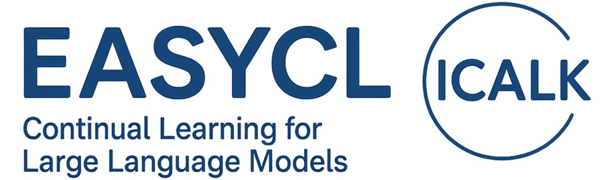

<!-- Logo (placeholder for future) -->
<!--  -->

[ [English](README.md) | [中文](README_zh.md) ]

<p align="center">
  <a href="#简介">📚 简介</a> •
  <a href="#已实现方法">🔍 已实现方法</a> •
  <a href="#安装">⚙️ 安装</a> •
  <a href="#工作流程">🚀 工作流程</a> •
  <a href="#许可证">📝 许可证</a>
</p>

## 简介

EasyCL 是 LLaMA Factory 框架的扩展，专注于大型语言模型的持续学习方法。它提供了一套全面的工具和方法，用于解决顺序学习任务中的灾难性遗忘问题。

该框架集成了各种专为语言模型设计的最先进持续学习技术，使研究人员和实践者能够轻松实现、比较和开发新方法。

有关持续学习工作流的详细实现，请参阅 [src/easycl/cl_workflow/README.md](src/easycl/cl_workflow/README.md)。

## 已实现方法

1. **弹性权重巩固 (EWC)** - [查看实现](src/easycl/cl/ewc/README.md)
   - 基于参数重要性添加正则化
   - 使用费舍尔信息矩阵衡量重要性

2. **无遗忘学习 (LWF)** - [查看实现](src/easycl/cl/lwf/README.md)
   - 通过知识蒸馏保留知识
   - 在不需要旧任务数据的情况下保持性能

3. **经验回放 (Experience Replay)** - [查看实现](src/easycl/cl/replay/README.md)
   - 重放先前任务的数据子集
   - 使用内存缓冲区存储过去的经验

4. **LAMOL (语言建模的终身语言学习)** - [查看实现](src/easycl/cl/lamol/README.md)
   - 生成先前任务的伪样本
   - 将生成的样本与当前任务数据结合

5. **O-LoRA (正交子空间学习)** - [查看实现](src/easycl/cl/olora/README.md)
   - 使用正交约束扩展 LoRA
   - 防止任务特定适应之间的干扰

6. **梯度情景记忆 (GEM)** - [查看实现](src/easycl/cl/gem/README.md)
   - 使用情景记忆投影梯度
   - 防止干扰过去任务的性能

7. **I-LoRA (基于插值的 LoRA)** - [查看实现](src/easycl/cl/ilora/README.md)
   - 使用双重记忆经验回放框架
   - 使用 EMA 更新插值 LoRA 参数

8. **CLMoE (持续学习混合专家与 LoRA)** - [查看实现](src/easycl/cl/clmoe/README.md)
   - 结合 MoE 架构与 LoRA 进行适应
   - 使用多个专家模块进行专业化 (名称根据clmoe目录调整)

9. **ABSCL (ABSA LLM-CL)** - [查看实现](src/easycl/cl/abscl/README.md)
   - 训练共享和任务特定适配器
   - 使用特征统计进行适配器选择

10. **动态 ConPet** - [查看实现](src/easycl/cl/dynamic_conpet/README.md)
    - 结合共享和任务特定适配器
    - 使用分类器进行动态路由

11. **自合成排练 (SSR)** - [查看实现](src/easycl/cl/ssr/README.md)
    - 从先前任务生成伪样本
    - 使用聚类获取多样化样本

12. **伪回放 (Pseudo Replay)** - [查看实现](src/easycl/cl/pseudo_replay/README.md)
    - SSR 的简化版本
    - 使用基础模型为先前任务生成样本

有关持续学习方法的更多详细信息，请参阅 [src/easycl/cl/README.md](src/easycl/cl/README.md)。

## 安装

```bash
git clone https://github.com/ECNU-ICALK/EasyCL.git
cd EasyCL
pip install -e . --no-deps
```
注意，如果你现在环境下已经安装了LLaMA-Factory或旧版EasyCL，你可能需要卸载现有的然后在重新执行一次安装。


## 工作流程

### 仅训练

```bash
easycl-cli cl_workflow --mode train_only --train_params ./configs/train_config.json
```

**预览结果**: 按顺序执行`train_config.json`中定义的任务训练命令，并在任务之间应用参数管理。

### 仅评估

```bash
easycl-cli cl_workflow --mode eval_only --eval_params ./configs/eval_config.json
```

**预览结果**: 执行`eval_config.json`中指定的评估命令（例如，在`cl_tasks`上评估特定的微调模型）。

### 先训练后评估

```bash
easycl-cli cl_workflow --mode train_then_eval \\
    --train_params ./configs/train_config_replay.json \\
    --eval_params ./configs/eval_config.json
```

**预览结果**: 按顺序执行训练命令，然后执行评估命令（评估基础模型和每个任务后的模型）。

### 完整工作流（训练、评估、计算指标）

```bash
easycl-cli cl_workflow --mode full_workflow \\
    --train_params ./configs/train_config.json \\
    --eval_params ./configs/eval_config.json
```

**预览结果**: 按顺序执行训练，然后评估基础/任务模型，最后计算并保存持续学习指标（Last、Avg、BWT、FWT）到评估输出目录。

有关工作流配置和持续学习指标的详细信息，请参阅 [src/easycl/cl_workflow/README.md](src/easycl/cl_workflow/README.md)。

## 许可证

本项目采用 Apache License 2.0 许可 - 详见 [LICENSE](LICENSE) 文件。
