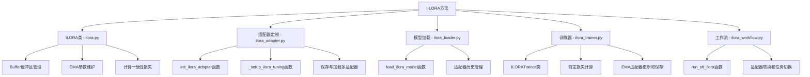
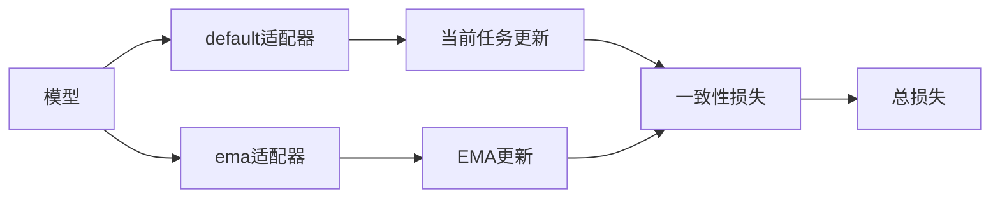
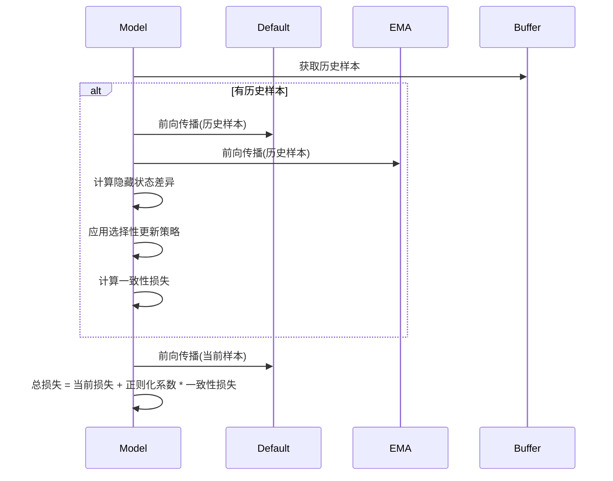
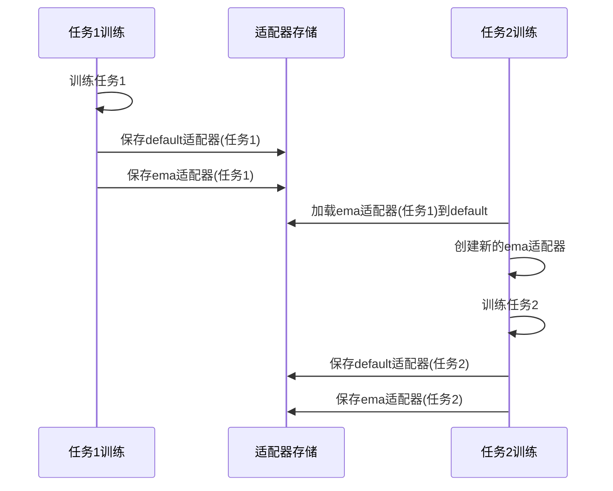

# I-LORA在LLaMA-Factory中的实现设计

## 1. 目录结构

按照LLaMA-Factory规范，I-LORA方法的实现需要创建以下文件结构：

```
src/llamafactory/cl/
└── ilora/
    ├── __init__.py           # 导出类和函数
    ├── ilora.py              # 核心算法实现
    ├── ilora_adapter.py      # 自定义LoRA适配器
    ├── ilora_loader.py       # 自定义模型加载器
    ├── ilora_trainer.py      # 自定义训练器
    ├── ilora_workflow.py     # 定义工作流程
    └── README.md             # 方法文档
```

## 2. 核心组件实现



### 2.1 核心算法 - `ilora.py`

ILORA类是实现核心功能的主要类，需包含以下组件：

**实现内容**：
- 实现Buffer类，用于经验回放缓冲区管理
- 实现ILORA主类，包含状态管理和参数计算
- 定义一致性损失计算逻辑

**关键方法**：
- `__init__`: 初始化ILORA对象、EMA参数和Buffer
- `update_ema_weights`: 更新EMA适配器的权重
- `compute_consistency_loss`: 计算隐藏状态一致性损失
- `store_sample`: 向Buffer添加样本
- `get_replay_samples`: 从Buffer获取历史样本

### 2.2 适配器定制 - `ilora_adapter.py`

扩展现有的LoRA适配器以支持I-LORA的多适配器功能。

**实现内容**：
- 导入基础适配器函数 `init_adapter`
- 定义`init_ilora_adapter`函数，扩展原有的适配器初始化
- 实现`_setup_ilora_tuning`函数，保留原有LoRA功能并添加EMA支持

**关键实现点**：
- 创建并管理default和ema两个适配器
- 确保原有LoRA功能完全保留
- 添加适配器间权重更新机制

### 2.3 模型加载 - `ilora_loader.py`

自定义模型加载器以支持I-LORA特有的初始化过程。

**实现内容**：
- 基于原始`load_model`函数创建`load_ilora_model`
- 替换`init_adapter`调用为`init_ilora_adapter`
- 其余逻辑与原始加载器保持一致

**关键实现点**：
- 保留原有模型加载流程
- 仅在适配器初始化环节进行定制

### 2.4 训练器 - `ilora_trainer.py`

实现I-LORA特定的训练器，处理一致性损失和缓冲区管理。

**实现内容**：
- 继承`CustomSeq2SeqTrainer`类
- 重写`compute_loss`方法添加一致性损失计算
- 添加回调机制更新EMA权重

**关键方法**：
- `__init__`: 初始化训练器，设置I-LORA实例和回调
- `compute_loss`: 计算总损失 = 原始损失 + 一致性损失

### 2.5 工作流 - `ilora_workflow.py`

定义使用I-LORA进行训练的完整流程。

**实现内容**：
- 实现`run_sft_ilora`函数
- 复用大部分`run_sft`代码
- 替换模型加载和训练器初始化为I-LORA特定版本

**关键实现点**：
- 使用`load_ilora_model`加载模型
- 初始化`ILORATrainer`
- 其余逻辑与标准SFT流程相同

### 2.6 初始化文件 - `__init__.py`

导出所有需要的类和函数，使外部可以直接导入。

```python
from llamafactory.cl.ilora.ilora import ILORA, Buffer
from llamafactory.cl.ilora.ilora_trainer import ILORATrainer
from llamafactory.cl.ilora.ilora_workflow import run_sft_ilora
from llamafactory.cl.ilora.ilora_adapter import init_ilora_adapter
from llamafactory.cl.ilora.ilora_loader import load_ilora_model

__all__ = [
    "ILORA",
    "Buffer",
    "ILORATrainer",
    "run_sft_ilora",
    "init_ilora_adapter",
    "load_ilora_model"
]
```

## 3. I-LORA关键功能

### 3.1 多适配器管理



I-LORA使用两个LoRA适配器：
- `default`: 当前正在训练的主适配器
- `ema`: 使用指数移动平均更新的稳定适配器

### 3.2 一致性损失计算



一致性损失的特点：
- 对每层隐藏状态计算MSE损失
- 使用选择性更新策略，仅保留有益更新
- 通过权重系数控制正则化强度

#### 3.2.1 详细的一致性损失计算实现

I-LORA的一致性损失计算是其创新点之一，它通过比较当前模型（default适配器）和稳定模型（ema适配器）在历史样本上的隐藏状态来正则化训练过程。具体实现如下：

**1. 损失函数定义**

在ILORA类的初始化中定义MSE损失函数：
```python
self.consistency_loss = nn.MSELoss(reduction='none')
```

**2. 获取历史样本**

从缓冲区获取历史样本进行一致性计算：
```python
buffer_inputs, buffer_labels = self.buffer.get_data(batch_size)
```

**3. 计算隐藏状态**

使用两个适配器分别计算历史样本的隐藏状态：

```python
# 使用default适配器（当前正在训练的模型）
self.model.set_adapter('default')
plastic_hidden = self.model(
    buffer_inputs,
    labels=buffer_labels,
    output_hidden_states=True,
    return_dict=True)

# 使用ema适配器（稳定模型），注意这里不需要梯度
self.model.set_adapter('ema')
with torch.no_grad():
    stable_hidden = self.model(
        buffer_inputs,
        labels=buffer_labels,
        output_hidden_states=True,
        return_dict=True).hidden_states
```

**4. 选择性更新策略**

I-LORA使用一种选择性更新策略，只保留当前模型表现优于稳定模型的部分（对每个隐藏状态元素进行比较）：

```python
# 创建比较索引，识别当前模型性能更好的部分
indices = [plastic > stable for plastic, stable in 
          zip(plastic_hidden.hidden_states, stable_hidden)]

# 选择性组合：对性能更好的部分使用plastic，否则使用stable
reg_hidden = [torch.where(idx, plastic, stable) for idx, plastic, stable in 
             zip(indices, plastic_hidden.hidden_states, stable_hidden)]
```

**5. 计算一致性损失**

对每层的隐藏状态计算MSE损失，然后取平均：

```python
# 计算每一层隐藏状态的MSE损失
layer_losses = [self.consistency_loss(plastic, reg) for plastic, reg in 
               zip(plastic_hidden.hidden_states, reg_hidden)]

# 合并所有层的损失并取平均
l_cons = torch.mean(torch.cat(layer_losses, dim=0))
```

**6. 组合最终损失**

最终，一致性损失与任务损失组合：

```python
# 计算当前任务的损失
self.model.set_adapter('default')
ori_out = self.model(
    input_ids=input_ids,
    labels=labels,
    return_dict=True)

# 组合损失
if labels is not None and buffer_inputs is not None and buffer_labels is not None:
    # 当有缓冲区样本时，结合当前任务损失和经验回放损失，再加上一致性损失
    total_loss = (ori_out.loss + plastic_hidden.loss) / 2 + self.reg_weight * l_cons
else:
    # 当没有缓冲区样本时，只使用当前任务损失和一致性损失（此时l_cons=0）
    total_loss = ori_out.loss + self.reg_weight * l_cons
```

**7. 实现细节和优化**

- **效率考虑**：一致性损失仅在有缓冲区样本时计算
- **梯度流动**：确保梯度只通过当前模型而非稳定模型流动
- **选择性更新**：使用element-wise的比较而非整体比较，提高精度
- **动态权重**：`reg_weight`参数可以控制一致性损失的影响程度
- **隐藏状态全层计算**：考虑模型的所有层，而非仅输出层，以全面捕获知识

这种方法的核心思想是保持模型在新任务学习中对旧任务的稳定性，通过隐藏状态一致性来度量知识保留程度，并通过选择性更新策略允许有益的参数更新。

### 3.3 缓冲区管理

Buffer类使用水库采样方法维护历史样本，主要操作包括：
- 添加样本：根据水库采样算法决定是否保留
- 获取样本：随机抽取指定数量的历史样本
- 缓冲区大小固定，自动管理样本替换

### 3.4 EMA适配器的保存与加载

I-LORA方法需要特殊的适配器保存和加载机制，以支持多适配器管理和EMA更新：



**保存机制**:
- 每个任务结束时保存两个适配器：`default`和`ema`
- 使用特定命名约定区分不同任务和适配器类型
- 保存目录结构如下：
  ```
  output_dir/
  ├── ilora_task1/
  │   ├── default/       # 任务1的主适配器
  │   └── ema/           # 任务1的EMA适配器
  └── ilora_task2/
      ├── default/       # 任务2的主适配器
      └── ema/           # 任务2的EMA适配器
  ```

**加载机制**:
- 在加载模型时检查是否有前一个任务的适配器
- 使用`CommonCLArguments.previous_task_model`参数确定上一个任务的路径
- 根据当前任务ID构建适配器加载路径
- 加载时需处理的关键点：
  1. 将上一任务的EMA适配器加载为当前任务的主适配器
  2. 为当前任务创建新的EMA适配器作为副本
  3. 处理适配器合并或转换的特殊情况

**EMA适配器更新的实现**:
- 在每个训练步骤结束时通过回调更新EMA适配器
- 实现`update_ema_weights`方法，使用指数移动平均更新权重
- 支持动态调整EMA系数（可选）

## 4. 与LLaMA-Factory框架集成

### 4.1 超参数定义

在`src/llamafactory/hparams/finetuning_args.py`中需添加以下参数：

```python
@dataclass
@dataclass
class ILORAArguments:
    """Arguments pertaining to I-LORA method."""
    
    use_ilora: bool = field(
        default=False,
        metadata={"help": "Whether to use I-LORA method."}
    )
    
    ema_alpha: float = field(
        default=0.25,
        metadata={"help": "EMA smoothing coefficient for I-LORA."}
    )
    
    consistency_weight: float = field(
        default=1.0,
        metadata={"help": "Weight coefficient for consistency loss in I-LORA."}
    )
    
    save_ema_adapter: bool = field(
        default=True,
        metadata={"help": "Whether to save EMA adapter in I-LORA."}
    )
    
    ema_adapter_path: str = field(
        default=None,
        metadata={"help": "Path to the EMA adapter, defaults to None for automatic path construction based on task ID."}
    )

    selective_update: bool = field(
        default=True,
        metadata={"help": "Whether to use selective update strategy in I-LORA."}
    )

    min_update_threshold: float = field(
        default=0.1,
        metadata={"help": "Minimum threshold for selective update in I-LORA."}
    )

    hidden_state_layers: List[int] = field(
        default_factory=lambda: [-1, -2, -3],
        metadata={"help": "Layers to compute hidden state consistency loss, -1 means last layer."}
    )

    ilora_buffer_size: int = field(
        default=500,
        metadata={"help": "Size of the experience replay buffer specifically for I-LORA method."}
    )
```

### 4.2 与训练器选择器集成

在`src/llamafactory/train/tuner.py`的`run_sft`函数中添加：

```python
if finetuning_args.use_ilora:
    from llamafactory.cl.ilora import run_sft_ilora
    return run_sft_ilora(
        model_args=model_args,
        data_args=data_args,
        training_args=training_args,
        finetuning_args=finetuning_args,
        generating_args=generating_args,
        callbacks=callbacks
    )
```

### 4.3 与CommonCLArguments的集成

I-LORA需要与`CommonCLArguments`中的参数协同工作，特别是：

```python
# 利用CommonCLArguments中的参数
previous_task_model: 用于指定上一个任务的模型路径，I-LORA会在此路径下寻找EMA适配器
current_task_id: 用于构建当前任务的适配器保存路径
prev_task_id: 用于构建上一个任务的适配器加载路径
```

具体集成方式：
- 在初始化ILORA类时读取这些参数
- 在加载和保存适配器时使用这些参数构建路径
- 确保在没有指定显式路径时使用这些参数自动构建路径

## 5. 实现注意事项

1. **LoRA功能完整保留**：
   - 在实现自定义适配器时，必须完整保留原有LoRA功能
   - 使用组合而非替换的方式添加I-LORA功能

2. **EMA更新机制**：
   - 通过回调机制在每个训练步骤后更新EMA适配器
   - 使用混合更新策略而非简单替换，以保留有益参数更新

3. **缓冲区实现**：
   - 缓冲区实现要考虑内存效率
   - 支持可变长度输入的存储和检索

4. **模型兼容性**：
   - 确保与不同底座模型的兼容性
   - 处理好量化模型的特殊情况

5. **适配器保存与加载**:
   - 保存适配器时使用明确的命名规则区分任务和适配器类型
   - 加载适配器时处理路径查找和适配器转换
   - 处理任务切换时的特殊逻辑，如将上一任务的EMA适配器作为新任务的起点
   - 确保在单任务和多任务场景下都能正确工作
