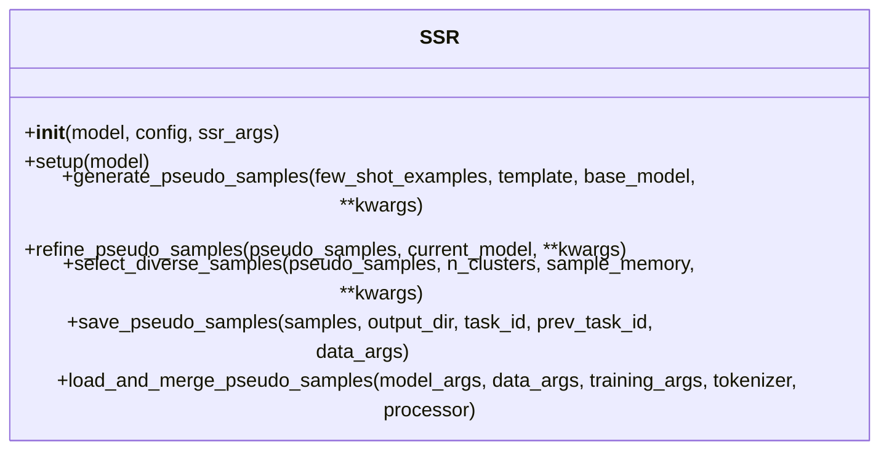
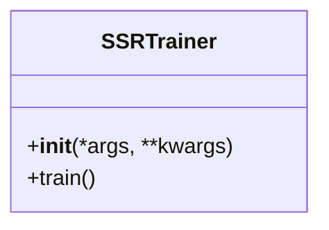
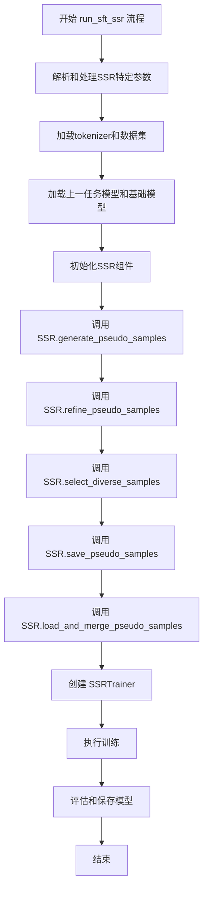
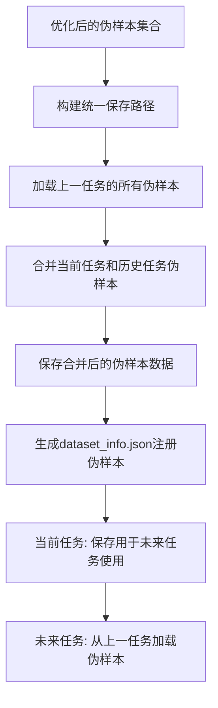
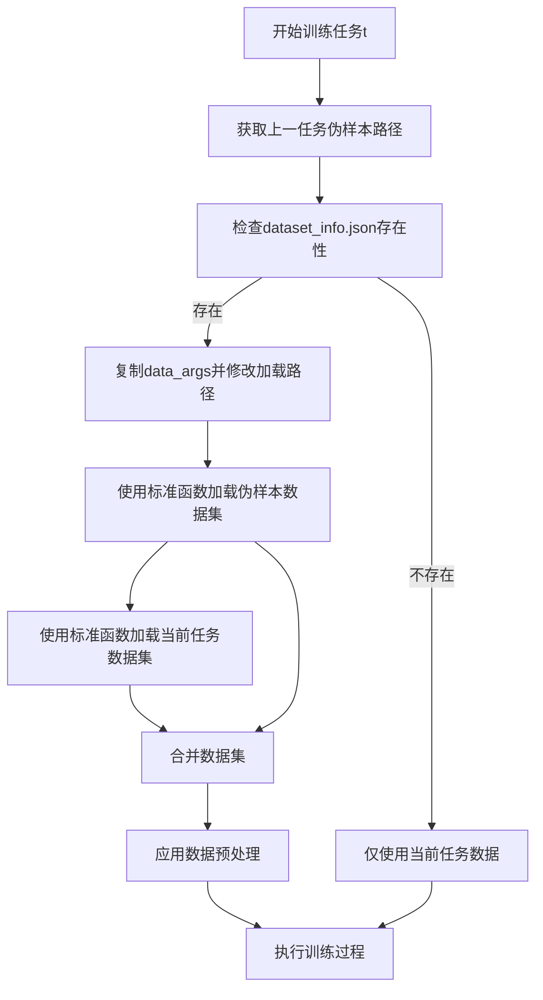

# SSR (Self-Synthesized Rehearsal) 方法设计文档

## 1. 方法概述

**Self-Synthesized Rehearsal (SSR)** 是一种**基于合成数据的重放（Rehearsal）策略**，用于在**大型语言模型（LLMs）**的**持续学习（Continual Learning, CL）**过程中**缓解灾难性遗忘（Catastrophic Forgetting）**。该方法的核心思想是利用LLM**自行生成用于重放的训练数据**，而不需要依赖真实历史数据。

SSR主要包含以下**三个核心组件**：
1. **基于上下文学习的实例合成（Instance Synthesis via In-Context Learning, ICL）**
2. **合成数据输出优化（Synthetic Output Refinement）**
3. **选择高质量合成数据进行重放（Rehearsal with Selected Synthetic Instances）**

## 2. 核心流程图

```mermaid
flowchart TD
    A[开始 SSR 过程] --> B1[检查是否为第一个任务]
    B1 -->|是| E1[直接使用当前任务数据训练]
    B1 -->|否| B2[基于上下文学习ICL生成合成数据]
    B2 -->|基础 LLM θ(0) 生成 (x̂, ŷ)| C[合成数据输出优化]
    C -->|最新 LLM θ(t-1) 生成优化 ȳ| D[选择高质量合成数据]
    D -->|使用 K-means 聚类| E2[构建最终训练数据集 D̂(t)]
    E1 --> F[训练 LLM θ(t)]
    E2 --> F
    F -->|新任务开始| B1
    F -->|结束| G[结束 SSR]
```

## 3. 文件结构和组件设计

按照LLaMA-Factory的持续学习方法集成要求，SSR方法需要实现以下文件结构：

```
src/llamafactory/cl/ssr/
├── __init__.py             # 导出模块组件
├── ssr.py                  # 核心算法实现
├── ssr_trainer.py          # 自定义训练器
├── ssr_workflow.py         # 自定义工作流程
└── README.md               # 方法文档
```

### 3.1 核心算法（ssr.py）

#### 功能概述
`ssr.py`文件实现SSR方法的核心算法，包括以下主要功能：
- 初始化SSR参数和配置
- 实现伪样本生成、优化、选择算法
- 处理伪样本的保存和加载

#### 核心类和方法

**SSR类**：


#### 功能流程详解

1. **初始化和配置**
   - 初始化SSR参数
   - 加载基础模型(不使用adapter_name_or_path)和上一个任务的模型(利用previous_task_model读取上个任务生成的adapter或完整模型，根据当前微调的模式调整)。

2. **模型处理功能**
   - 提供模型配置调整的功能
   - 管理模型使用的适配器和权重
   - 为模型训练做必要的准备工作

3. **伪样本生成与处理功能**
   - 通过ICL生成初始伪样本（generate_pseudo_samples方法）
   - 使用当前任务模型优化伪样本输出（refine_pseudo_samples方法）
   - 对伪样本进行多样化选择（select_diverse_samples方法）
   - 保存伪样本到指定目录（save_pseudo_samples方法）
   - 加载和合并伪样本与训练数据（load_and_merge_pseudo_samples方法）

**核心方法实现**：

```python
# 部分实现示例


def generate_pseudo_samples(self, few_shot_examples, template, base_model, **kwargs):
    """使用基础模型通过ICL生成伪样本"""
    - 从上一任务数据中选择few-shot示例
    - 构建ICL prompt
    - 使用基础模型生成pseudo_sample_memory个伪样本
    - 解析和验证生成的伪样本
    return parsed_samples

def refine_pseudo_samples(self, pseudo_samples, current_model, **kwargs):
    """使用前一任务模型优化伪样本输出"""
    - 提取伪样本的输入部分
    - 使用前一任务模型重新生成输出
    - 替换原始输出
    return refined_samples

def select_diverse_samples(self, pseudo_samples, n_clusters, sample_memory, **kwargs):
    """使用聚类方法选择多样化的伪样本"""
    - 使用SIMcse提取伪样本文本的嵌入表示
    - 执行K-means聚类
    - 从每个聚类中选择最靠近样本中心的样本
    - 输出n_clusters个伪样本（如果n_cluster大于pseudo_sample_memory则全部输出）
    return selected_samples

def save_pseudo_samples(self, samples, output_dir, task_id, prev_task_id=None, data_args=None):
    """保存伪样本到指定目录，并生成dataset_info.json注册信息"""
    import os
    import json
    import copy
    import shutil
    
    # 1. 构建保存路径
    task_dir = os.path.join(output_dir, task_id)
    os.makedirs(task_dir, exist_ok=True)
    
    # 2. 如果存在上一任务的伪样本，先加载它们
    prev_samples = []
    if prev_task_id and prev_task_id != task_id:
        prev_task_dir = os.path.join(output_dir, prev_task_id)
        if os.path.exists(prev_task_dir):
            # 检查前序任务的伪样本文件
            for prev_file in os.listdir(prev_task_dir):
                if prev_file.startswith("pseudo_") and prev_file.endswith(".json"):
                    prev_file_path = os.path.join(prev_task_dir, prev_file)
                    try:
                        with open(prev_file_path, 'r', encoding='utf-8') as f:
                            prev_data = json.load(f)
                            prev_samples.extend(prev_data)
                    except Exception as e:
                        print(f"加载前序任务伪样本出错: {e}")
    
    # 3. 合并当前任务生成的伪样本和历史伪样本
    all_samples = samples + prev_samples
    
    # 4. 保存合并后的伪样本
    pseudo_file_name = f"pseudo_{task_id}.json"
    pseudo_file_path = os.path.join(task_dir, pseudo_file_name)
    
    with open(pseudo_file_path, 'w', encoding='utf-8') as f:
        json.dump(all_samples, f, ensure_ascii=False, indent=2)
    
    # 5. 从原始数据集获取格式信息
    dataset_format = self.get_dataset_format(data_args)
    
    # 6. 构建数据集注册信息
    dataset_info = {
        f"pseudo_{task_id}": {
            "file_name": pseudo_file_name,
            "formatting": dataset_format["formatting"],
            "split": "train"
        }
    }
    
    # 7. 如果有其他格式特定配置，添加到注册信息中
    if "columns" in dataset_format:
        dataset_info[f"pseudo_{task_id}"]["columns"] = dataset_format["columns"]
    if "tags" in dataset_format:
        dataset_info[f"pseudo_{task_id}"]["tags"] = dataset_format["tags"]
    
    # 8. 保存数据集注册信息
    dataset_info_path = os.path.join(task_dir, "dataset_info.json")
    with open(dataset_info_path, 'w', encoding='utf-8') as f:
        json.dump(dataset_info, f, ensure_ascii=False, indent=2)
        
    print(f"已保存当前任务和历史任务的合并伪样本到 {pseudo_file_path}")
    print(f"包含当前任务伪样本: {len(samples)}个")
    print(f"包含历史任务伪样本: {len(prev_samples)}个")
    print(f"总伪样本数量: {len(all_samples)}个")
    
    return pseudo_file_path

def get_dataset_format(self, data_args):
    """从原始数据集获取格式信息，用于创建与之兼容的dataset_info.json"""
    import json
    import os
    from ..data.parser import get_dataset_list
    
    # 获取当前任务的数据集信息
    dataset_list = get_dataset_list(data_args.dataset, data_args.dataset_dir)
    if not dataset_list:
        # 使用默认的alpaca格式
        return {"formatting": "alpaca", "split": "train"}
    
    # 假设我们使用第一个数据集作为参考
    dataset_info_path = os.path.join(data_args.dataset_dir, "dataset_info.json")
    if os.path.exists(dataset_info_path):
        try:
            with open(dataset_info_path, 'r', encoding='utf-8') as f:
                dataset_info = json.load(f)
                # 获取当前任务的数据集名称
                dataset_name = data_args.dataset[0] if isinstance(data_args.dataset, list) else data_args.dataset
                if dataset_name in dataset_info:
                    # 提取该数据集的格式信息
                    format_info = {}
                    src_info = dataset_info[dataset_name]
                    
                    # 复制基本格式信息
                    format_info["formatting"] = src_info.get("formatting", "alpaca")
                    format_info["split"] = src_info.get("split", "train")
                    
                    # 复制额外的格式信息
                    if "columns" in src_info:
                        format_info["columns"] = src_info["columns"]
                    if "tags" in src_info:
                        format_info["tags"] = src_info["tags"]
                    
                    return format_info
        except Exception as e:
            print(f"Error reading dataset_info.json: {e}")
    
    # 如果无法获取格式信息，返回默认格式
    return {"formatting": "alpaca", "split": "train"}

def load_and_merge_pseudo_samples(self, model_args, data_args, training_args, tokenizer, processor=None):
    """加载历史伪样本并与当前任务数据合并"""
    # 实现同之前的load_and_merge_pseudo_samples函数...
```

**与工作流程的交互接口**：
这些方法为workflow提供了清晰的接口，使workflow可以方便地调用这些功能而不必关心具体实现细节。

### 3.2 自定义训练器（ssr_trainer.py）

#### 功能概述
`ssr_trainer.py`你应该直接调用trainer.py中的CustomSeq2SeqTrainer并做重命名，而不添加任何额外模块。

#### 核心类和方法

**SSRTrainer类**：


#### 训练流程详解

训练流程将包括以下步骤：
1. 初始化训练器
2. 获取由workflow合并好的训练数据集（当前任务数据+历史伪样本）
3. 执行标准训练流程
4. 保存训练结果

### 3.3 自定义工作流程（ssr_workflow.py）

#### 功能概述
`ssr_workflow.py`实现SSR方法的完整工作流程，定义训练过程中的各个步骤。**特别注意**，SSR方法在第一个任务时不需要生成伪样本，因为没有历史任务可供生成。只有在后续任务中才会启动伪样本生成、优化和选择的流程。


#### 核心函数

**run_sft_ssr函数**：
- 首先通过`finetuning_args.prev_task_id`判断是否为第一个任务
- 如果是第一个任务：
  - 直接使用当前任务数据进行训练
  - 跳过伪样本生成和处理流程
- 如果是后续任务：
  - 处理SSR方法特定的参数设置
  - 初始化模型和数据集
  - 初始化SSR类实例
  - 调用SSR类中的方法进行伪样本生成、优化和选择
  - 调用SSR类中的方法保存伪样本
  - 调用SSR类中的方法加载历史伪样本并与当前任务数据合并
- 创建SSRTrainer并执行训练
- 保存模型和评估结果

#### 工作流程详解



#### 合并伪样本和当前训练样本示例
``` python
def run_sft_new_method(
    model_args,
    data_args,
    training_args,
    finetuning_args,
    generating_args,
    callbacks=None
):
    # 基础设置部分（与普通workflow相同）
    tokenizer_module = load_tokenizer(model_args)
    tokenizer = tokenizer_module["tokenizer"]
    template = get_template_and_fix_tokenizer(tokenizer, data_args)
    
    # 如果使用伪样本，准备两组数据参数并加载
    if finetuning_args.use_ssr :
        # 准备两组不同的数据参数
        data_args_orig = copy.deepcopy(data_args)  # 原始数据参数
        data_args_pseudo = copy.deepcopy(data_args)  # 伪样本数据参数
        
        # 设置不同的数据目录和数据集名称
        data_args_pseudo.dataset_dir = finetuning_args.pseudo_samples_path
        data_args_pseudo.dataset = [f"pseudo_{task_id}" for task_id in data_args.dataset]
        
        # 使用get_dataset加载原始数据集
        dataset_module_orig = get_dataset(
            template=template,
            model_args=model_args,
            data_args=data_args_orig,
            training_args=training_args,
            stage="sft",
            **tokenizer_module
        )
        
        # 使用get_dataset加载伪样本数据集
        dataset_module_pseudo = get_dataset(
            template=template,
            model_args=model_args,
            data_args=data_args_pseudo,
            training_args=training_args,
            stage="sft",
            **tokenizer_module
        )
        
        # 合并训练集
        merged_module = {}
        if "train_dataset" in dataset_module_orig and "train_dataset" in dataset_module_pseudo:
            # 设置合并策略
            merged_data_args = copy.deepcopy(data_args)
            merged_data_args.mix_strategy = finetuning_args.dataset_mix_strategy or "concat"
            
            # 合并训练集
            train_datasets = [
                dataset_module_orig["train_dataset"],
                dataset_module_pseudo["train_dataset"]
            ]
            merged_module["train_dataset"] = merge_dataset(
                train_datasets,
                merged_data_args,
                seed=training_args.seed
            )
        elif "train_dataset" in dataset_module_orig:
            merged_module["train_dataset"] = dataset_module_orig["train_dataset"]
        elif "train_dataset" in dataset_module_pseudo:
            merged_module["train_dataset"] = dataset_module_pseudo["train_dataset"]
            
        # 合并验证集（如果存在）
        eval_dataset = {}
        if "eval_dataset" in dataset_module_orig:
            if isinstance(dataset_module_orig["eval_dataset"], dict):
                eval_dataset.update(dataset_module_orig["eval_dataset"])
            else:
                eval_dataset["orig"] = dataset_module_orig["eval_dataset"]
                
        if "eval_dataset" in dataset_module_pseudo:
            if isinstance(dataset_module_pseudo["eval_dataset"], dict):
                eval_dataset.update(dataset_module_pseudo["eval_dataset"])
            else:
                eval_dataset["pseudo"] = dataset_module_pseudo["eval_dataset"]
                
        if eval_dataset:
            merged_module["eval_dataset"] = eval_dataset
            
        dataset_module = merged_module
    else:
        # 标准数据集加载（无伪样本）
        dataset_module = get_dataset(
            template=template,
            model_args=model_args,
            data_args=data_args,
            training_args=training_args,
            stage="sft",
            **tokenizer_module
        )
    
    # 加载模型与后续步骤
```

**各步骤详细解释**：

1. **参数解析和初始化**：
   - 解析命令行参数，识别SSR特定参数
   - 初始化模型状态和数据流
   - 使用`CommonModelArguments`加载基础配置

2. **数据和模型准备**：
   - 使用`load_tokenizer_and_model`函数加载tokenizer和模型
   - 加载对应任务的训练数据集
   - 根据`base_model_path`加载ICL生成用的基础模型
   - 根据`previous_task_model`加载上一任务的模型

3. **SSR组件初始化**：
   - 创建SSR类实例
   - 传入必要的参数和模型

4. **伪样本生成和处理**：
   - 调用SSR实例的generate_pseudo_samples方法生成伪样本
   - 调用SSR实例的refine_pseudo_samples方法优化伪样本
   - 调用SSR实例的select_diverse_samples方法选择样本
   - 调用SSR实例的save_pseudo_samples方法保存伪样本
   - 调用SSR实例的load_and_merge_pseudo_samples方法加载和合并数据集

5. **模型训练**：
   - 使用合并后的数据集创建SSRTrainer
   - 执行训练过程
   - 评估模型性能
   - 保存训练后的模型

**注意事项**：
- Workflow只需要调用SSR类提供的方法，不需要关心具体实现细节
- 所有与伪样本处理相关的复杂逻辑都封装在SSR类中
- 这种设计使得代码职责更加清晰，Workflow只负责流程编排，具体功能由SSR类实现

## 4. SSR参数定义

为了实现SSR方法，需要在LLaMA-Factory中定义以下参数：

### SSRArguments类
```python
@dataclass
class SSRArguments:
    """SSR (Self-Synthesized Rehearsal) 方法的特定参数"""
    
    use_ssr: bool = field(
        default=False,
        metadata={"help": "是否使用SSR方法进行持续学习"}
    )
    
    # 基本SSR参数
    base_model_path: Optional[str] = field(
        default=None,
        metadata={"help": "用于ICL生成伪样本的基础模型路径"}
    )
    
    # 样本生成参数
    num_shots: int = field(
        default=2,
        metadata={"help": "ICL中使用的示例数量"}
    )
    
    generation_temperature: float = field(
        default=0.9,
        metadata={"help": "生成伪样本时的温度参数"}
    )
    
    # 聚类和选择参数
    n_clusters: int = field(
        default=20,
        metadata={"help": "K-means聚类的簇数量"}
    )
    
    pseudo_sample_memory: int = field(
        default=200,
        metadata={"help": "每个任务保留的伪样本数量"}
    )
    
    # 伪样本存储参数
    pseudo_samples_dir: str = field(
        default="pseudo_samples",
        metadata={"help": "统一存储所有伪样本的目录路径"}
    )
    
    # 使用CommonCLArguments中已定义的参数
    # previous_task_model: 上一任务的模型路径
    # current_task_id: 当前任务ID
    # prev_task_id: 上一任务ID
    # buffer_size: 总体重放缓冲区大小
```

## 5. SSR方法实现重点

### 5.1 模型使用说明

SSR方法使用三种不同的模型：

1. **基础模型（θ(0)）**：
   - 用途：通过ICL生成初始伪样本
   - 来源：使用`model_args.model_name_or_path`指定的模型，同时**移除**`model_args.adapter_name_or_path`设置
   - 原因：初始预训练模型具有更好的通用ICL能力，适合生成多样化的伪样本

2. **最新模型（θ(t-1)）**：
   - 用途：优化和提炼伪样本
   - 来源：使用`model_args.model_name_or_path`指定的模型，同时将`model_args.adapter_name_or_path`设置为`finetuning_args.previous_task_model`
   - 原因：已适应任务的模型可以生成更符合当前知识的输出

3. **当前任务模型（θ(t)）**：
   - 用途：当前正在训练的模型
   - 训练数据：当前任务数据 + 所有历史任务的伪样本
   - 目标：学习新任务同时保留旧任务知识

### 5.2 伪样本生成和处理流程

#### 5.2.1 任务类型判断

在开始伪样本生成之前，SSR方法首先需要判断当前是否为第一个任务：

1. **判断依据**：
   - 通过检查`finetuning_args.prev_task_id`是否为`None`来判断
   - 如果为`None`，说明是第一个任务
   - 如果不为`None`，说明是后续任务

2. **第一个任务的处理**：
   - 不需要生成和处理伪样本
   - 直接使用当前任务数据进行训练
   - 保存训练后的模型，供后续任务使用

3. **后续任务的处理**：
   - 需要完整执行SSR的伪样本生成和处理流程
   - 使用前一个任务的数据生成伪样本
   - 优化和选择高质量伪样本
   - 将伪样本与当前任务数据合并后进行训练

#### 5.2.2 Few-shot示例获取

**示例来源**：
- 原始实现中，few-shot示例是**从前一个任务的数据集中获取**的，随机选取代表性样本。

#### 5.2.3 ICL Prompt模板

分析原始实现中的prompt模板，发现主要有三种类型的模板：标准模板（Vanilla）、LLaMA-2模板和Alpaca模板。这些模板有不同的前导指令和格式，但核心结构相似。对于任务指导生成，我们采用一个统一的通用prompt模板：

**统一的SSR ICL Prompt模板**：
```

Create task samples following examples below.

Instruction: {示例1指令}
Input: {示例1输入}
Output: {示例1输出}

Instruction: {示例2指令}
Input: {示例2输入}
Output: {示例2输出}

...

Instruction:
```

其中：
- "Create task samples following examples below."是额外添加的引导语，明确指示模型生成任务样本。
- 示例部分包含从前一个任务中选择的few-shot示例，每个示例由指令、输入和输出三部分组成。
- 最后是"Instruction:"提示符，等待模型生成新的指令、输入和输出。

这个模板结构参考自`complete_param_alpaca.py`中的实现：

```python
instruction = 'Create task instructions following examples below.\n\n'
for i in lis:
    input = data[i]['input']
    input = "<noinput>" if input.lower() == "" else input
    instruction += (
        f"Instruction: {data[i]['instruction']}\n" +
        f"Input: {input}\n" +
        f"Output: {data[i]['output']}\n\n")
instruction += 'Instruction:'
```


#### 5.2.4 伪样本输出解析

生成的伪样本需要正确解析才能用于后续处理。：

1. **分离指令、输入和输出**：
   - 使用"Output:"、"Input:"和"Instruction:"作为分隔标记
   - 首先分割"Output:"获取输出内容和前面部分
   - 然后在前面部分中分割"Input:"获取输入内容和指令部分
   - 最后提取指令部分
   
2. **处理特殊情况**：
   - 如果输入为空，则使用"<noinput>"标记，解析时需要将其转换回空字符串
   - 如果无法正确分割成三部分，则过滤掉该样本
   - 确保指令部分不为空
   
3. **合并和验证**：
   - 对于每个成功解析的样本，构建包含指令、输入和输出的完整样本
   - 验证样本长度是否在允许范围内，过滤掉过长或过短的样本
   - 验证是否有重复样本，确保多样性

#### 5.2.5 伪样本生成策略

### 5.3 伪样本优化详细说明

在优化阶段，系统会：
1. 使用最新模型（θ(t-1)）处理伪样本的输入部分x̂
2. 生成新的输出ȳ，替代原始生成的输出ŷ
3. 针对生成的伪样本进行嵌入向量提取（使用SimCSE模型）
4. 对嵌入向量进行K-means聚类（n_cluster）
5. 对嵌入向量进行归一化处理
6. 计算每个样本到所属聚类中心的距离
7. 从每个聚类中选择最靠近中心的样本（最具代表性）
8. 根据n_cluster选择输出的伪样本的数量。

这一过程对于提高伪样本的质量非常重要，因为：
- 基础模型生成的输出可能不够精确
- 经过任务适应的最新模型能提供更符合任务特性的输出
- 优化后的伪样本更能反映模型当前的知识状态

### 5.4 伪样本保存和加载机制

在生成和优化伪样本后，SSR方法会将这些伪样本保存到统一的存储位置，以便后续任务使用：



**统一存储策略**：
- 所有任务的伪样本都存储在由`pseudo_samples_dir`参数指定的统一目录下
- 该目录可以是绝对路径，也可以是相对于训练输出目录的相对路径
- 在该目录内，每个任务都有一个以任务ID命名的子目录，用于存储该任务的伪样本

**伪样本存储结构**：
```
{pseudo_samples_dir}/
├── task_1/
│   ├── pseudo_task_1.json   # 任务1的伪样本数据
│   └── dataset_info.json    # 任务1的伪样本数据集注册信息
├── task_2/
│   ├── pseudo_task_2.json   # 包含任务2的伪样本+任务1的伪样本
│   └── dataset_info.json    # 任务2的伪样本数据集注册信息
├── task_3/
│   ├── pseudo_task_3.json   # 包含任务3的伪样本+任务2和1的伪样本
│   └── dataset_info.json    # 任务3的伪样本数据集注册信息
└── ...
```

**优化的伪样本合并策略**：
- 每个任务生成伪样本时，会加载上一任务的伪样本文件
- 将当前任务生成的伪样本与上一任务的所有伪样本合并到一个文件中
- 这种方式确保每个任务的伪样本文件都包含了所有历史伪样本
- 简化了数据加载流程，只需加载最新任务的一个伪样本文件

**dataset_info.json格式**：
伪样本的注册格式需要与原始训练数据的格式一致，例如：
```json
{
  "pseudo_task_id": {
    "file_name": "pseudo_task_id.json",
    "formatting": "alpaca",
    "split": "train"
  }
}
```

或者对于更复杂的数据格式：
```json
{
  "pseudo_task_id": {
    "file_name": "pseudo_task_id.json",
    "formatting": "sharegpt",
    "columns": {
      "messages": "messages",
      "videos": "videos"
    },
    "tags": {
      "role_tag": "role",
      "content_tag": "content",
      "user_tag": "user",
      "assistant_tag": "assistant"
    }
  }
}
```

**保存内容**：
- 当前任务生成的伪样本
- 从上一任务继承的所有历史伪样本
- 合并后的数据集格式信息
- 任务ID、生成时间等元数据信息

**实现方式**：
- 在`SSR`类中实现保存逻辑
- 使用标准JSON库进行数据序列化和保存
- 需要检查和获取当前任务数据集的注册格式，以创建一致的dataset_info.json
- 使用`os.path.join`和`os.makedirs`函数创建目录结构

### 5.5 伪样本加载与合并流程

**重要说明**：在训练新任务时，SSR方法会从上一个任务的伪样本目录加载数据。由于每个任务的伪样本文件都已经包含了所有历史任务的伪样本，因此只需要加载一个文件就能获取所有历史任务的伪样本数据。



